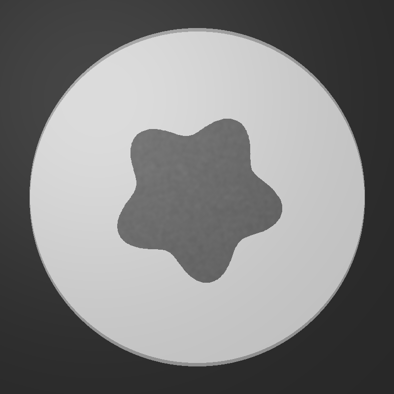
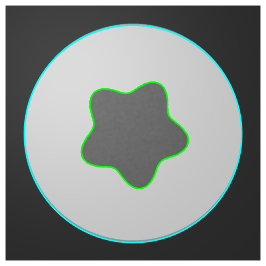
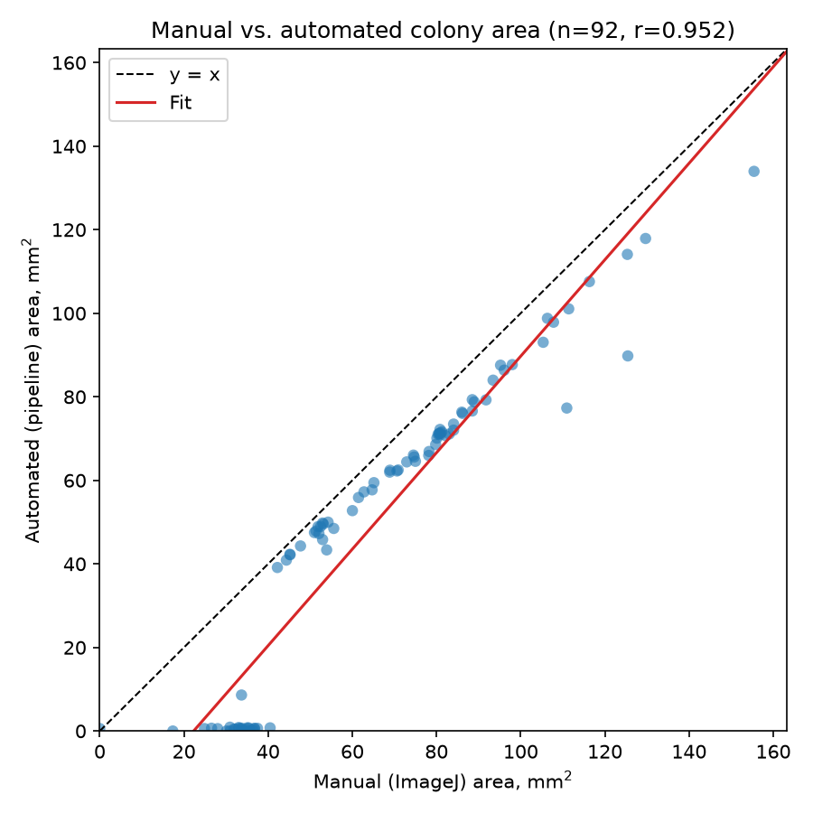
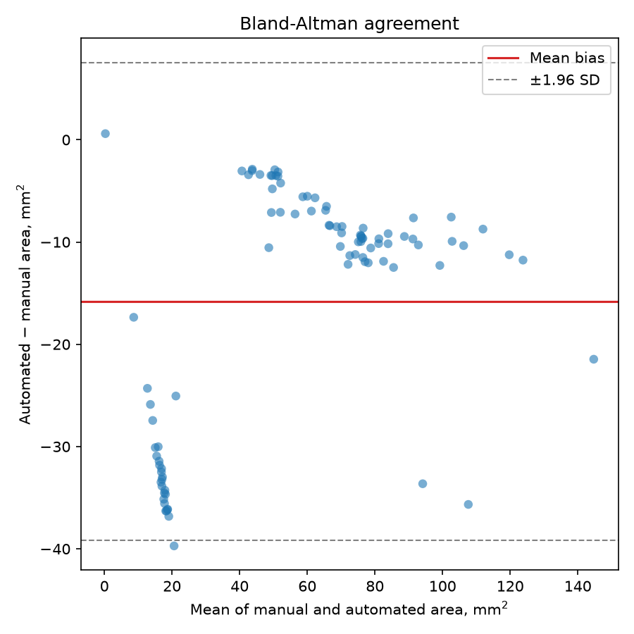
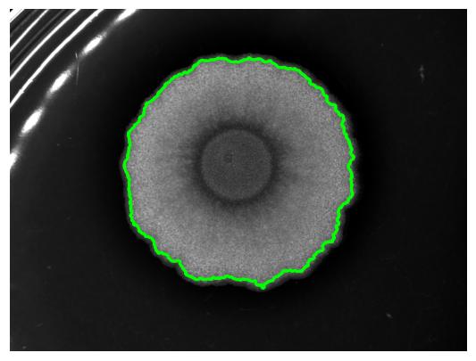

# Colony Biofilm Morphometrics

A classical computer-vision pipeline that turns photographs of bacterial colony
biofilms on agar plates into quantitative shape and texture measurements —
automating an analysis I previously did in ImageJ (using the Quant-it macro)
during my MSc research on *Bacillus subtilis* biofilm genetics.

## The biological problem

*B. subtilis* colonies grown on agar develop complex multicellular
architecture as they age: wild-type colonies form deeply wrinkled, radially
furrowed biofilms built from an extracellular matrix of exopolysaccharide and
the amyloid protein TasA, while matrix-deficient mutants (e.g. Δ*eps*,
Δ*tasA*) produce smooth, featureless colonies because they cannot build that
structure. Comparing colony morphology across strains — wrinkling, margin
shape, spreading area — is a standard low-cost readout for biofilm matrix
function, normally scored by eye or measured colony-by-colony in ImageJ. This
tool automates that measurement: segment the colony, calibrate pixels to
millimetres (from the dish rim, or from calibration already embedded in the
image file), and compute the same shape descriptors consistently across a
whole folder of plates.

## Installation

```bash
git clone <this-repo>
cd BiofilmColony-morphometrics

# with conda
conda env create -f environment.yml
conda activate BiofilmColony-morphometrics

# or with a plain venv
python -m venv .venv
.venv/Scripts/activate      # Windows; use `source .venv/bin/activate` on macOS/Linux
pip install -r requirements.txt
```

Requires Python 3.11+.

## Usage

**Batch process a folder of plate photographs → CSV + overlays:**

```bash
python -m src.cli --input data/plates --output results --dish-diameter 90
```

Writes `results/measurements.csv` (one row per image) and one annotated
overlay per image to `results/overlays/`. A corrupt or unreadable file is
logged and skipped — it never aborts the batch. Run `python -m src.cli --help`
for tuning flags (`--threshold-offset`, `--min-object-size`,
`--morph-kernel-size`, `--colony-brighter-than-background`).

**Calibration** tries two sources, in order:

1. **Embedded metadata** — if the source TIFF carries an ImageJ-format pixel
   size (`XResolution`/`YResolution` + a `unit=` field in
   `ImageDescription`, as written by ImageJ/Fiji or exported from
   microscope acquisition software), that calibration is used directly.
   This is the only option that works for photographs cropped to a single
   colony, e.g. several biofilms plated and imaged separately on the same
   dish, where the dish rim isn't in frame.
2. **Dish rim detection** — otherwise, falls back to locating the Petri
   dish rim via Hough circle transform and `--dish-diameter`, which needs
   the whole dish visible in the photograph.

If neither succeeds, metrics are reported in pixel units with a warning
rather than silently wrong millimetres.

**Colony brighter or darker than the background?** The default assumes a
colony darker than the surrounding agar (a typical top-lit photograph). Some
imaging setups do the opposite — a biofilm that scatters/reflects light
against a dark background reads as *brighter* than its surroundings. Pass
`--colony-brighter-than-background` in that case; segmentation otherwise
finds the background instead of the colony.

**Review segmentation quality and correct outliers interactively:**

```bash
python -m src.gui
```

Opens a window to browse a folder image-by-image, adjust segmentation
sliders with the overlay updating live, save per-image parameter overrides
for problem plates, and export the batch CSV once you're satisfied.

**Validate against manual ImageJ measurements:**

```bash
python -m scripts.validate_against_manual \
    --images-dir path/to/plates \
    --manual-csv path/to/manual_measurements.csv \
    --colony-brighter-than-background
```

Reprocesses a folder through the pipeline, matches each result to a manual
measurement by filename, and reports Pearson correlation and Bland-Altman
agreement (see Validation below). Written for this project's MSc dataset
naming convention (`<prefix>.lif_-_<colony>_QBf.tif` ↔ CSV `Label`
`<prefix>.lif - <colony>`); adjust `filename_to_label` in the script to
match a different manual dataset's naming.

**Use the pipeline directly in Python:**

```python
from src.segment import load_image, segment_colony
from src.calibrate import calibrate
from src.metrics import compute_all_metrics

image = load_image("data/example/synthetic_colony.png")
seg = segment_colony(image)
cal = calibrate(image, dish_diameter_mm=90)
metrics = compute_all_metrics(seg.colony_mask, seg.gray, mm_per_pixel=cal.mm_per_pixel)
```

## Example

`data/example/synthetic_colony.png` is a **synthetically generated** test
plate (see `data/example/make_synthetic_example.py`) — an irregular, lobed
blob standing in for a colony, used so the pipeline and tests don't depend on
real photographs. Drop your own plate photos into a folder and point
`--input` at it to analyse real data.

| Input | Segmentation + calibration overlay |
|---|---|
|  |  |

Resulting measurements (`results/measurements.csv`):

| filename | area (mm²) | perimeter (mm) | circularity | solidity | equiv. diameter (mm) | texture contrast | texture entropy | calibrated |
|---|---|---|---|---|---|---|---|---|
| synthetic_colony.png | 1252.5 | 144.2 | 0.757 | 0.888 | 39.9 | 0.009 | 0.234 | True |

## Metrics explained

| Metric | Formula / method | What it captures biologically |
|---|---|---|
| **Area** | colony pixel count × calibration | Substrate area colonised — the standard readout for radial expansion. |
| **Perimeter** | Crofton perimeter estimator | Boundary length; dominated by colony size, so interpreted alongside circularity rather than alone. |
| **Circularity** | 4πA / P² | Wrinkling proxy. 1.0 for a smooth circle; drops well below 1 for a wrinkled, radially furrowed margin. Matrix mutants (smooth) score near 1; wild-type (wrinkled) scores lower. Unit-independent. |
| **Solidity** | area / convex hull area | Lobing/notching proxy, independent of surface wrinkling: a deeply lobed or furrowed *outline* has low solidity even if the colony's surface texture is separately smooth or rough. |
| **Equivalent diameter** | diameter of a circle with equal area | Size summary comparable to manual ruler/caliper measurements. |
| **Texture contrast** | GLCM contrast, computed only on colony pixels | Local surface roughness — light/shadow ridges from wrinkle topology raise this. |
| **Texture entropy** | GLCM entropy, computed only on colony pixels | Disorder of the surface pattern — a uniform matte colony is low, an intricately, irregularly ridged one is high. |

Circularity and solidity both catch "not a smooth circle," but from different
angles — a colony can have a smooth macroscopic outline (high solidity) while
its surface is finely wrinkled (which drags circularity down and raises
texture contrast/entropy), or a deeply lobed margin (low solidity) with an
otherwise plain surface.

## Validation

Validated against 92 real plate photographs from my MSc *B. subtilis*
biofilm work (stereo-microscope TIFFs, one colony per crop), each with a
colony area previously measured in ImageJ with the Quant-it macro.
Reprocessing that set
through `scripts/validate_against_manual.py` (with
`--colony-brighter-than-background`, since these were imaged with the
biofilm scattering light brightly against a dark background) gives:

| n | Pearson r | Mean bias | 95% limits of agreement | RMSE |
|---|---|---|---|---|
| 92 | 0.952 | −15.8 mm² (−37%) | [−39.2, +7.6] mm² | 19.8 mm² |

| Manual vs. automated area | Bland-Altman agreement | Example real-data overlay |
|---|---|---|
|  |  |  |

Automated area tracks the Quant-it measurements closely (r = 0.952) but runs
systematically smaller — this pipeline's threshold draws the colony boundary
a little inside where Quant-it's ImageJ measurement would put it, especially
for larger, more diffuse colonies (the bias grows with colony size in the
Bland-Altman plot). This is a genuine boundary-definition difference between
the two thresholding approaches to keep in mind when comparing new automated
measurements against historical Quant-it ones, not a validation failure.

7 of the 92 images (colonies with low colony/background contrast) produced
no detectable mask at all with the default parameters and are included in
the stats above as automated area = 0 — the large cluster of outliers at the
bottom of the Bland-Altman plot. This is exactly the failure mode the GUI's
per-image parameter overrides exist for; it was not chased further here to
avoid overfitting one global threshold to this particular batch. See
`scripts/validate_against_manual.py`'s console output for the affected
filenames.

Circularity and texture metrics have no manual equivalent in this dataset,
so those remain to be validated qualitatively — checking that matrix mutants
and wild-type separate in the expected direction.

*The real photographs and manual CSV used for this validation are personal
MSc research data and are not included in this repository; the numbers above
are reproducible against them but the script also works against any
similarly-organised dataset.*

## Limitations and future work

- **Single colony per plate.** The pipeline assumes exactly one colony,
  selected as the largest connected component not touching the image
  border. Multiple colonies or contamination on one plate are not handled.
- **Classical segmentation, not learned.** Otsu thresholding and morphology
  work well on plates with reasonable colony/agar contrast and even
  lighting, but can fail on low-contrast or unevenly lit photographs — the
  GUI's manual override sliders exist specifically for those cases.
- **Illumination correction requires the correction kernel radius to exceed
  the colony's own radius** (see `segment.correct_illumination`'s
  docstring), otherwise the correction erases the colony's contrast instead
  of just the lighting gradient. The default (200px) is a reasonable
  starting point, not a guarantee, for an arbitrary photo resolution/framing.
- **Dish detection (Hough circle transform) is sensitivity-tuned, not
  bulletproof.** It can miss the rim on low-contrast or heavily reflective
  dishes; when it does (and there's no embedded metadata calibration either),
  the tool falls back to pixel units with a clear warning rather than
  reporting wrong millimetres.
- **Low-contrast colonies can fail to segment entirely.** In the validation
  set, 7/92 real photographs produced no detectable mask with default
  parameters (see Validation above) — the GUI's per-image overrides exist
  for exactly this case, but a folder of difficult images may need manual
  review rather than a single unattended batch run.
- **No run history.** Each batch run overwrites `results/measurements.csv`;
  there's no versioning of repeated runs over time.

## Project structure

```
BiofilmColony-morphometrics/
├── src/
│   ├── segment.py     # illumination correction, thresholding, colony mask
│   ├── calibrate.py   # metadata + dish rim calibration, pixel -> mm
│   ├── metrics.py     # shape + texture measurements
│   ├── batch.py       # folder -> CSV + overlays
│   ├── cli.py         # command-line entry point
│   └── gui.py         # Tkinter segmentation review tool
├── scripts/
│   └── validate_against_manual.py  # batch process + compare to manual CSV
├── tests/              # pytest, synthetic images generated with NumPy
├── data/example/       # synthetic demo plate + generator script
├── docs/images/        # README-embedded images
└── results/            # batch output (measurements.csv, overlays/)
```

## Running tests

```bash
pytest -v
```

35 tests covering shape/texture metrics against synthetic masks with known
geometry, calibration maths against a known dish radius and against
synthetic ImageJ-format TIFF metadata, segmentation correctness on synthetic
plates, and batch processing continuing past a deliberately corrupt file —
no real photographs required.
